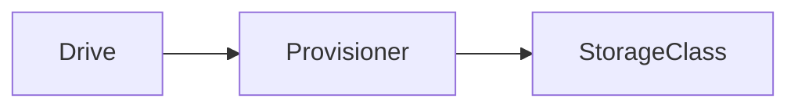
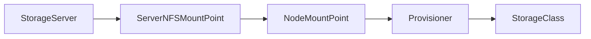

[[_ TOC _]]
# NFS Proivisioner

## Weblink
```notes
https://github.com/kubernetes-sigs/nfs-ganesha-server-and-external-provisioner
```
### Local drives



### Network shares



#### Server:
Create an NFS share.  Set/Configure the share to private for security.  Setup your rule for access from the clients and get on with it.

##### Rules example

```notes
IpAddress(sec=yes,rw)
```

```multipleRulesSeparatedBySpace
IpAddress(sec=yes,rw) IpAddress(sec=yes,rw)
```

#### Client

##### Create directory

```bash # Create your local mountpoint/folder location
sudo mkdir -p /path/to/folder/to/mount/to
```

##### Mount the nfs share

```bash
sudo mount host_ip:/server/path/to/share/mount/point /local/path/you/created
```
